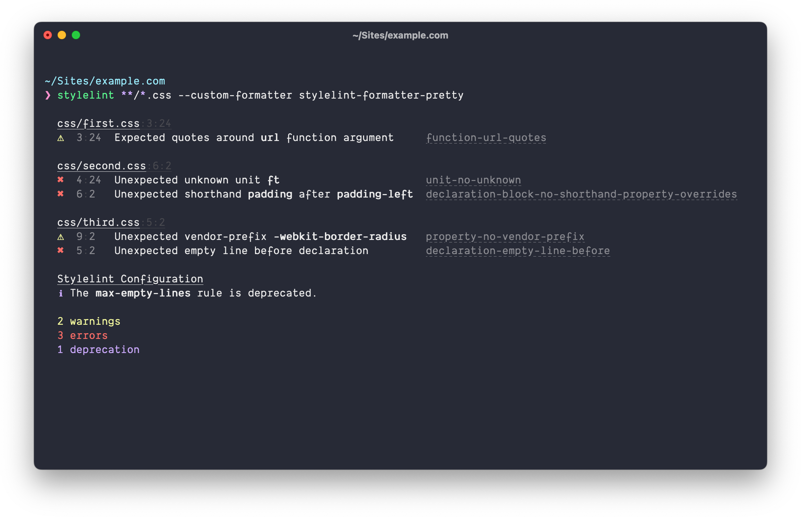

# stylelint-formatter-pretty

> A pretty formatter for [Stylelint](https://stylelint.io/)


[](https://travis-ci.org/Dreamseer/stylelint-formatter-pretty)
[](https://coveralls.io/github/Dreamseer/stylelint-formatter-pretty?branch=main)

[](https://packagephobia.now.sh/result?p=stylelint-formatter-pretty)
[](https://github.com/sindresorhus/xo)
[](https://github.com/Dreamseer/stylelint-formatter-pretty/blob/main/LICENSE.md)



## Install

Using [npm](https://www.npmjs.com/get-npm):

```bash
npm install --save-dev stylelint-formatter-pretty
```

Using [yarn](https://yarnpkg.com/):

```bash
yarn add stylelint-formatter-pretty --dev
```

## Usage

### Stylelint CLI

```bash
stylelint file.css --custom-formatter=node_modules/stylelint-formatter-pretty
```

### [grunt-stylelint](https://github.com/wikimedia/grunt-stylelint)

```js
const stylelintFormatter = require('stylelint-formatter-pretty');

grunt.initConfig({
  stylelint: {
    options: {
      formatter: stylelintFormatter
    },
    all: ['css/**/*.css']
  }
});

grunt.loadNpmTasks('grunt-stylelint');
grunt.registerTask('default', ['stylelint']);
```

### [gulp-stylelint](https://github.com/olegskl/gulp-stylelint)

```js
const gulp = require('gulp');
const stylelint = require('gulp-stylelint');
const stylelintFormatter = require('stylelint-formatter-pretty');

gulp.task('lint', () =>
  gulp.src('file.css')
    .pipe(stylelint({
      reporters: [ {
        formatter: stylelintFormatter,
        console: true
      } ]
    }));
);
```

### [Webpack](https://github.com/JaKXz/stylelint-webpack-plugin)

```js
const styleLintPlugin = require('stylelint-webpack-plugin');
const stylelintFormatter = require('stylelint-formatter-pretty');

module.exports = {
  // ...
  plugins: [
    new styleLintPlugin({
      formatter: stylelintFormatter
    }),
  ],
  // ...
}
```

## Tip

In iTerm, <kbd>Cmd</kbd>+Click the filename header to open the file in your editor.

## Related

* [eslint-formatter-pretty](https://github.com/sindresorhus/eslint-formatter-pretty) – a pretty ESLint formatter

## License

MIT © [Sindre Sorhus](https://sindresorhus.com/), [Marc Görtz](https://marcgoertz.de/)
